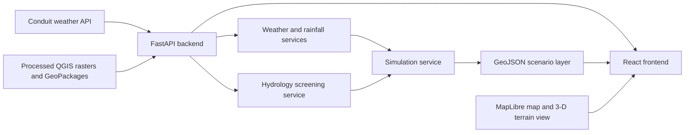

# Juja Flood & Environmental Digital Twin

Juja Flood & Environmental Digital Twin is a full-stack geospatial decision-support prototype for Juja, Kenya. It combines JHUB Africa Conduit weather-station observations with QGIS-derived terrain and drainage layers to visualise current conditions and run rainfall-driven flood-hazard screening scenarios. 

**Note:** This project is a screening tool, not a calibrated hydraulic flood-depth prediction system.

## Problem
Communities, planners, and institutions in rapidly developing areas such as Juja need timely, location-specific information about rainfall, terrain, and drainage conditions. Weather observations alone do not show where runoff is likely to concentrate, while static terrain data does not reflect changing rainfall conditions. This project brings local weather observations together with a consistent geospatial model for researchers, planners, emergency-response teams, infrastructure stakeholders, and other users who need an interpretable view of rainfall-related exposure.

## Solution
The application provides:
* **Interactive Dashboard:** Visualises current weather, rainfall metrics, terrain, drainage, and flood-screening layers.
* **Scenario Simulation:** A dedicated view where users input custom rainfall and duration assumptions to inspect resulting scenario layers.
* **FastAPI Backend:** Serves terrain products, live weather data, derived rainfall metrics, and GeoJSON scenario results.
* **Modern Frontend:** Built with React and MapLibre for interactive 2D mapping and a high-performance Juja 3D terrain showcase.

The screening model uses flow accumulation as a drainage-concentration proxy, slope as a terrain-retention proxy, rainfall intensity as the dynamic forcing, and antecedent rainfall to adjust the runoff coefficient. The final result is vectorised into GeoJSON for seamless web application rendering.

## Conduit@Empathy Data
The project processes live weather-station data provided through the JHUB Africa Conduit API:
* **Station Identifier:** `JHUB_JUJA_01`
* **Observations Used:** Timestamp, rainfall counters, temperature, humidity, pressure, wind speed, wind direction, and gust values.

The backend requests the latest two days of observations, normalises the provider fields, and selects the most recent entry. Rainfall processing treats the station readings as approximately 15-minute observations:
* `rg1` is used as interval rainfall in millimetres.
* Interval rainfall multiplied by four provides an hourly intensity estimate.
* `rg1tt` provides total rainfall for the day.
* `rg1tp` provides antecedent rainfall used by the screening model.

Conduit data drives the live forcing for the `/flood/current` endpoint. It is combined with the processed DEM, slope, and flow-accumulation raster layers to produce a terrain-rainfall screening result. The application does not fabricate weather observations when Conduit is unavailable.

## Features
* Current JHUB Conduit weather observation display.
* Rainfall interval, hourly intensity, daily total, and antecedent rainfall metrics.
* Interactive Juja map with wards, streams, watersheds, buildings, hillshade, and elevation.
* User-defined rainfall scenario simulation.
* Live station-driven flood-screening scenario.
* GeoJSON screening output and affected-area summary.
* Terrain-RGB elevation tiles for the MapLibre 3D view.
* Optional MapTiler basemaps and building extrusion.
* Interactive FastAPI OpenAPI documentation.
* Automated test suite covering API endpoints, GIS integrity, and hydrology calculations.

## Architecture


## Technology Stack

### Backend & Geospatial Processing
* Python 3.10+
* FastAPI and Uvicorn
* Pydantic and `pydantic-settings`
* Requests (Conduit API client)
* NumPy (Numerical calculations)
* Rasterio (Raster reading and vectorisation)
* GeoPandas, Shapely, and Pyogrio (GIS data and GeoJSON pipelines)
* Pillow (Raster preview responses)
* Pytest and HTTPX (Testing suite)

### Frontend
* TypeScript
* React 19
* Vite
* MapLibre GL JS
* Axios
* Turf.js (Geospatial helpers and point-in-polygon utilities)

### Data & External Services
* JHUB Africa Conduit weather API
* QGIS-produced GeoTIFF and GeoPackage layers
* Optional MapTiler styles, terrain, and vector tiles

## Installation and Setup

### Prerequisites
* Git
* Python 3.10+ with a geospatial-capable environment
* Node.js and npm (compatible with Vite 7)
* **Configuration:** Copy the `.env.example` file to `.env` in your backend directory and supply your JHUB Africa Conduit API and optional MapTiler API credentials before launching.

### Run the Backend
From the repository root directory:
```bash
python -m pip install -r backend/requirements.txt
python -m uvicorn backend.app.main:app --reload --port 8000
```
* **API base URL:** `http://localhost:8000`
* **Interactive Documentation (Swagger UI):** `http://localhost:8000/api/v1/docs`

### Run the Frontend
In a separate terminal window:
```bash
cd frontend
npm install
npm run dev
```
Open the local server URL provided by Vite (typically `http://localhost:5173`).

## Testing
To run the automated tests from the repository root:
```bash
python -m pytest backend/tests -q
```
The test suite validates API routing, GIS file integrity, and core hydrology calculations. Unit tests and local GIS checks run entirely offline; live Conduit connection tests require network access and configured credentials.

## Data and Scientific Limitations
The current flood layer is a **terrain-rainfall screening model**. It is not a calibrated 2D hydraulic simulation and does not provide measured flood depth, velocity, or a validated flood extent. 

The project depends on pre-processed QGIS layers, including `conditioned_dem.tif`, `slope.tif`, `hillshade.tif`, `flow_direction.tif`, `flow_accumulation.tif`, `stream.gpkg`, and `watershed.gpkg`. Reference boundaries are constrained to Kiambu County, Kiambu sub-counties, Juja Constituency, and Juja wards.

Future scientific improvements include integrating land-cover and imperviousness data, soil infiltration parameters, channel and drainage dimensions, observed historical flood extents, rainfall hyetographs, and full hydraulic calibration.

## Attribution and Licensing
This repository contains original project source code alongside references to external services and baseline layers:
* **JHUB Africa Conduit data:** Subject to the terms and access agreements supplied by JHUB Africa.
* **OpenStreetMap data:** Attributed under the Open Database License (ODbL).
* **MapTiler services:** Utilised according to standard MapTiler terms of service.
* **Dependencies:** Python and JavaScript packages are bound by their respective open-source licensing agreements.

## Project Status
This application is a functional prototype tailored for the Juja region. It is designed for exploratory visualization and macro-level scenario screening. Output metrics should be reviewed by a qualified hydrologist or GIS professional before informing operational risk decisions.
