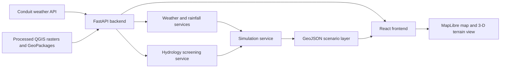

# Juja Flood & Environmental Digital Twin

Juja Flood & Environmental Digital Twin is a full-stack geospatial decision-support prototype for Juja, Kenya. It combines JHUB Africa Conduit weather-station observations with QGIS-derived terrain and drainage layers to visualise current conditions and run rainfall-driven flood-hazard screening scenarios.

The project is a screening tool, not a calibrated hydraulic flood-depth prediction system.

## Problem

Communities, planners and institutions in rapidly developing areas such as Juja need timely, location-specific information about rainfall, terrain and drainage conditions. Weather observations alone do not show where runoff is likely to concentrate, while static terrain data does not reflect changing rainfall conditions.

This project brings local weather observations together with a consistent geospatial model for researchers, planners, emergency-response teams, infrastructure stakeholders and other users who need an interpretable view of rainfall-related exposure.

## Solution

The application provides:

1. A dashboard for current weather, rainfall metrics, terrain, drainage and flood-screening layers.
2. A simulation view where users provide rainfall and duration assumptions and inspect the resulting scenario layer.
3. A FastAPI backend that serves terrain products, weather data, derived rainfall metrics and GeoJSON scenario results.
4. A React and MapLibre frontend for interactive 2-D mapping and a Juja 3-D terrain showcase.

The screening model uses flow accumulation as a drainage-concentration proxy, slope as a terrain-retention proxy, rainfall intensity as the dynamic forcing and antecedent rainfall to adjust the runoff coefficient. The result is vectorised into GeoJSON for display in the web application.

## Conduit@Empathy Data

The project uses weather-station data provided through the JHUB Africa Conduit API:

- API endpoint: `https://conduit.jhubafrica.com/data.php`
- Station identifier used by the application: `JHUB_JUJA_01`
- Observations used: timestamp, rainfall counters, temperature, humidity, pressure, wind speed, wind direction and gust values.
- Request method: HTTP `POST` with `apikey`, `email`, `fromdate` and `todate` fields.

The backend requests the latest two days of observations, normalises the provider fields and selects the most recent observation. Rainfall processing treats the station readings as approximately 15-minute observations:

- `rg1` is used as interval rainfall in millimetres.
- Interval rainfall multiplied by four provides an hourly intensity estimate.
- `rg1tt` provides total rainfall for the day.
- `rg1tp` provides antecedent rainfall used by the screening model.

Conduit data is used in the weather panel and as the live forcing for the `/flood/current` endpoint. It is combined with the processed DEM, slope and flow-accumulation raster layers to produce a terrain-rainfall screening result. The application does not fabricate weather observations when Conduit is unavailable.

## Features

- Current JHUB Conduit weather observation display.
- Rainfall interval, hourly intensity, daily total and antecedent rainfall metrics.
- Interactive Juja map with wards, streams, watersheds, buildings, hillshade and elevation.
- User-defined rainfall scenario simulation.
- Live station-driven flood-screening scenario.
- GeoJSON screening output and affected-area summary.
- Terrain-RGB elevation tiles for the MapLibre 3-D view.
- Optional MapTiler basemaps and building extrusion.
- FastAPI OpenAPI documentation.
- Automated tests for API endpoints, GIS integrity and hydrology calculations.

## Architecture



### Data chain

```text
Reference boundaries
        -> Juja study area
        -> conditioned DEM, slope and hillshade
        -> flow direction and flow accumulation
        -> streams and watersheds

Conduit rainfall observations
        -> rainfall metrics
        -> terrain-rainfall screening index
        -> GeoJSON scenario layer
        -> React and MapLibre visualisation
```

## Technology Stack

### Backend and geospatial processing

- Python 3.10 or newer
- FastAPI and Uvicorn
- Pydantic and `pydantic-settings`
- Requests for the Conduit API client
- NumPy for numerical calculations
- Rasterio for raster reading and vectorisation
- GeoPandas, Shapely and Pyogrio for GIS data and GeoJSON output
- Pillow for raster preview responses
- Pytest and HTTPX for testing

### Frontend

- TypeScript
- React 19
- Vite
- MapLibre GL JS
- Axios
- Turf helpers and point-in-polygon utilities

### Data and external services

- JHUB Africa Conduit weather API
- QGIS-produced GeoTIFF and GeoPackage layers
- Optional MapTiler styles, terrain and vector tiles
- No database or trained AI/ML model is required by the current implementation.

## Repository Structure

```text
digital-twin/
├── backend/
│   ├── app/
│   │   ├── api/             FastAPI route modules
│   │   ├── models/          Pydantic request and response models
│   │   └── services/        Conduit, rainfall, terrain and simulation logic
│   ├── requirements.txt
│   └── tests/
├── data/
│   ├── reference/           Administrative and study-area boundaries
│   ├── processed/           QGIS terrain and hydrology products
│   └── derived/             Derived application layers
├── frontend/
│   ├── src/components/      Dashboard UI components
│   ├── src/map/             Map and layer configuration
│   ├── src/pages/           Dashboard and simulation pages
│   └── src/services/        Backend API clients
├── notebooks/               Exploration, validation and showcase notebooks
├── python/                  Data-processing pipeline scripts
└── qgis/                    QGIS project file
```

## Installation and Setup

### Prerequisites

- Git
- Python 3.10+ with a geospatial-capable environment
- Node.js and npm compatible with Vite 7
- Access credentials for the JHUB Africa Conduit API for live weather and live flood screening
- Optional MapTiler API key for MapTiler basemaps and 3-D building tiles

### Configure secrets

Copy `.env.example` to `.env` in the repository root and set:

```env
JHUB_API_KEY=your_jhub_api_key
JHUB_EMAIL=your_jhub_email
MAPTILER_KEY=your_maptiler_key
```

Never commit `.env`, API keys, passwords or access tokens. The backend reads the root `.env`. The frontend reads its own `frontend/.env` file for browser settings:

```env
VITE_API_BASE_URL=http://localhost:8000/api/v1
VITE_MAPTILER_KEY=your_maptiler_key
```

OpenStreetMap remains available without a MapTiler key.

### Run the backend

From the repository root:

```powershell
python -m pip install -r backend/requirements.txt
python -m uvicorn backend.app.main:app --reload --port 8000
```

The API is available at `http://localhost:8000`. Interactive documentation is available at `http://localhost:8000/api/v1/docs`.

### Run the frontend

In a second terminal:

```powershell
cd frontend
npm install
npm run dev
```

Open the Vite URL shown in the terminal, normally `http://localhost:5173`.

To verify a production frontend build:

```powershell
npm run build
```

## API Endpoints

All application endpoints use the `/api/v1` prefix.

| Method | Endpoint | Purpose |
| --- | --- | --- |
| GET | `/` | Service health check |
| GET | `/weather/current` | Latest Conduit observation |
| GET | `/weather/metrics` | Derived rainfall metrics |
| GET | `/weather/history` | Recent weather observations |
| GET | `/terrain/summary` | Terrain summary |
| GET | `/terrain/streams` | Stream GeoJSON |
| GET | `/terrain/watersheds` | Watershed GeoJSON |
| GET | `/terrain/hillshade.png` | Hillshade preview |
| GET | `/terrain/elevation.png` | Elevation preview |
| GET | `/terrain/dem/{z}/{x}/{y}.png` | Terrain-RGB tile |
| GET | `/layers/{layer_name}` | Processed layer access |
| GET | `/flood/current` | Conduit-driven screening scenario |
| POST | `/simulation/run` | User-defined screening scenario |

## Testing

From the repository root:

```powershell
python -m pytest backend/tests -q
```

The tests cover API behaviour, GIS file integrity and hydrology calculations. Live Conduit tests require valid credentials and network access; unit and local GIS tests can run without the external API.

## Data and Scientific Limitations

The current flood layer is a **terrain-rainfall screening model**. It is not a calibrated 2-D hydraulic simulation and does not provide measured flood depth, velocity or a validated flood extent.

The project currently depends on processed QGIS products including `conditioned_dem.tif`, `slope.tif`, `hillshade.tif`, `flow_direction.tif`, `flow_accumulation.tif`, `stream.gpkg` and `watershed.gpkg`. Reference boundaries include Kiambu County, Kiambu sub-counties, Juja Constituency and Juja wards.

Future scientific improvements include land-cover and imperviousness data, soil and infiltration parameters, channel and drainage capacity, observed flood extents, rainfall hyetographs, calibration and validation, and a hydraulic model where the available data supports it.

## Attribution and Licensing

This repository contains project source code, project-generated or project-processed GIS outputs, and references to external services. Before public submission, retain the original attribution and licence terms for:

- JHUB Africa Conduit data and API access, according to the terms supplied by the data provider.
- OpenStreetMap data, which requires attribution under the Open Database License (ODbL) where applicable.
- MapTiler services and tiles, according to the selected MapTiler plan and terms.
- Any source boundary, DEM, imagery or other third-party dataset added to the repository.
- Python and JavaScript dependencies, each under its own package licence.

Do not redistribute provider data or credentials unless the relevant provider permits it. Add explicit source citations and licence files for any externally sourced datasets included in a release.

## Project Status

This is a working prototype for Juja. It is suitable for exploration, visualisation and scenario screening. Results should be reviewed by a qualified hydrologist or GIS professional before being used for operational decisions.
